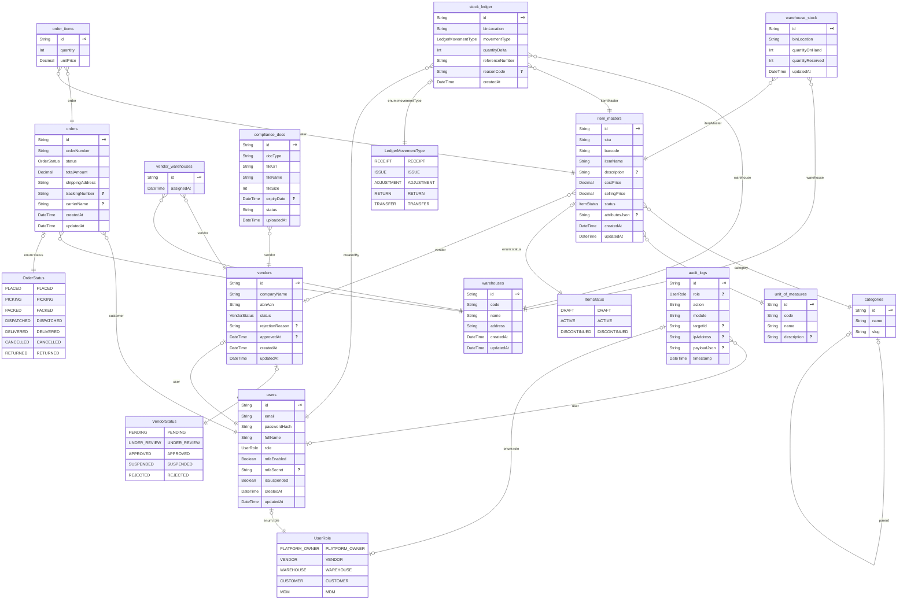

```mermaid
erDiagram

        UserRole {
            PLATFORM_OWNER PLATFORM_OWNER
VENDOR VENDOR
WAREHOUSE WAREHOUSE
CUSTOMER CUSTOMER
MDM MDM
        }
    


        VendorStatus {
            PENDING PENDING
UNDER_REVIEW UNDER_REVIEW
APPROVED APPROVED
SUSPENDED SUSPENDED
REJECTED REJECTED
        }
    


        ItemStatus {
            DRAFT DRAFT
ACTIVE ACTIVE
DISCONTINUED DISCONTINUED
        }
    


        OrderStatus {
            PLACED PLACED
PICKING PICKING
PACKED PACKED
DISPATCHED DISPATCHED
DELIVERED DELIVERED
CANCELLED CANCELLED
RETURNED RETURNED
        }
    


        LedgerMovementType {
            RECEIPT RECEIPT
ISSUE ISSUE
ADJUSTMENT ADJUSTMENT
RETURN RETURN
TRANSFER TRANSFER
        }
    
  "users" {
    String id "🗝️"
    String email 
    String passwordHash 
    String fullName 
    UserRole role 
    Boolean mfaEnabled 
    String mfaSecret "❓"
    Boolean isSuspended 
    DateTime createdAt 
    DateTime updatedAt 
    }
  

  "vendors" {
    String id "🗝️"
    String companyName 
    String abnAcn 
    VendorStatus status 
    String rejectionReason "❓"
    DateTime approvedAt "❓"
    DateTime createdAt 
    DateTime updatedAt 
    }
  

  "vendor_warehouses" {
    String id "🗝️"
    DateTime assignedAt 
    }
  

  "compliance_docs" {
    String id "🗝️"
    String docType 
    String fileUrl 
    String fileName 
    Int fileSize 
    DateTime expiryDate "❓"
    String status 
    DateTime uploadedAt 
    }
  

  "categories" {
    String id "🗝️"
    String name 
    String slug 
    }
  

  "unit_of_measures" {
    String id "🗝️"
    String code 
    String name 
    String description "❓"
    }
  

  "item_masters" {
    String id "🗝️"
    String sku 
    String barcode 
    String itemName 
    String description "❓"
    Decimal costPrice 
    Decimal sellingPrice 
    ItemStatus status 
    String attributesJson "❓"
    DateTime createdAt 
    DateTime updatedAt 
    }
  

  "warehouses" {
    String id "🗝️"
    String code 
    String name 
    String address 
    DateTime createdAt 
    DateTime updatedAt 
    }
  

  "warehouse_stock" {
    String id "🗝️"
    String binLocation 
    Int quantityOnHand 
    Int quantityReserved 
    DateTime updatedAt 
    }
  

  "stock_ledger" {
    String id "🗝️"
    String binLocation 
    LedgerMovementType movementType 
    Int quantityDelta 
    String referenceNumber 
    String reasonCode "❓"
    DateTime createdAt 
    }
  

  "orders" {
    String id "🗝️"
    String orderNumber 
    OrderStatus status 
    Decimal totalAmount 
    String shippingAddress 
    String trackingNumber "❓"
    String carrierName "❓"
    DateTime createdAt 
    DateTime updatedAt 
    }
  

  "order_items" {
    String id "🗝️"
    Int quantity 
    Decimal unitPrice 
    }
  

  "audit_logs" {
    String id "🗝️"
    UserRole role "❓"
    String action 
    String module 
    String targetId "❓"
    String ipAddress "❓"
    String payloadJson "❓"
    DateTime timestamp 
    }
  
    "users" |o--|| "UserRole" : "enum:role"
    "vendors" |o--|| "VendorStatus" : "enum:status"
    "vendors" |o--|| users : "user"
    "vendor_warehouses" }o--|| vendors : "vendor"
    "vendor_warehouses" }o--|| warehouses : "warehouse"
    "compliance_docs" }o--|| vendors : "vendor"
    "categories" |o--|o categories : "parent"
    "item_masters" }o--|| categories : "category"
    "item_masters" }o--|| unit_of_measures : "uom"
    "item_masters" |o--|| "ItemStatus" : "enum:status"
    "item_masters" }o--|o vendors : "vendor"
    "warehouse_stock" }o--|| warehouses : "warehouse"
    "warehouse_stock" }o--|| item_masters : "itemMaster"
    "stock_ledger" }o--|| warehouses : "warehouse"
    "stock_ledger" }o--|| item_masters : "itemMaster"
    "stock_ledger" |o--|| "LedgerMovementType" : "enum:movementType"
    "stock_ledger" }o--|| users : "createdBy"
    "orders" }o--|| users : "customer"
    "orders" }o--|| warehouses : "warehouse"
    "orders" |o--|| "OrderStatus" : "enum:status"
    "order_items" }o--|| orders : "order"
    "order_items" }o--|| item_masters : "itemMaster"
    "audit_logs" }o--|o users : "user"
    "audit_logs" |o--|o "UserRole" : "enum:role"
```
