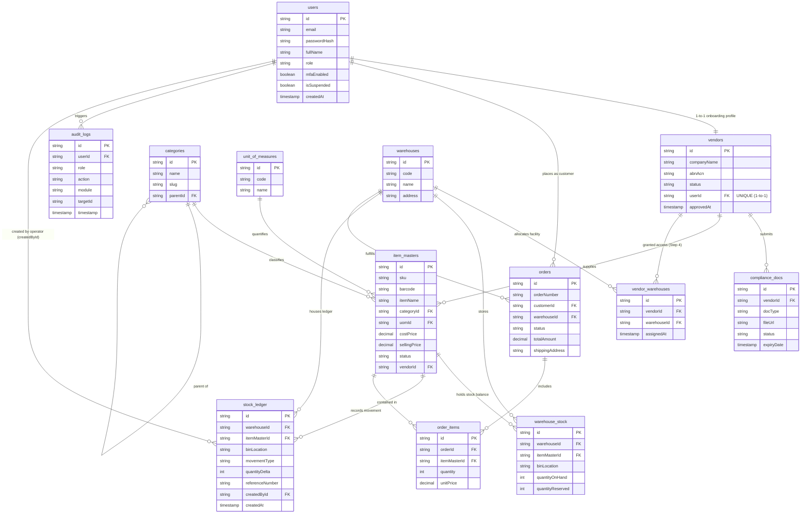

# LogiQ-On Tech — Architectural Database ERD (Enhanced)

**Jira Task:** KAN-1 (Day 1 — Environment Setup & Database Schema)  
**Database Engine:** PostgreSQL 16 (Managed via Prisma ORM)  
**Architectural Version:** 2.0 (Enhanced with VendorWarehouse Junction, User-StockLedger Relation, 1:1 User-Vendor Uniqueness, and PostgreSQL Performance Indexes)

---

## 1. Clean Crow's Foot ERD Diagram (Mermaid)

---

## 2. Key Architectural Enhancements Implemented

### 1. Added `User` $\rightarrow$ `StockLedger` Audit Relation (`createdBy`)
* **Relation**: `User ||--o{ stock_ledger`
* **Schema Fields**: `User.ledgerEntries StockLedger[] @relation("LedgerCreatedBy")` $\leftrightarrow$ `StockLedger.createdBy User @relation("LedgerCreatedBy", fields: [createdById], references: [id])`.
* **Business Purpose**: Tracks the exact warehouse operator/user who executed each inventory movement (`RECEIPT`, `ISSUE`, `ADJUSTMENT`, `RETURN`, `TRANSFER`) for accountability.

### 2. Added Vendor ↔ Warehouse Access Junction Table (`vendor_warehouses`)
* **Relation**: `Vendor 1 --- * VendorWarehouse * --- 1 Warehouse`
* **Diagram Step**: Directly satisfies **Diagram Step 4 ("Access Granted to Warehouse Point")**.
* **Schema Fields**: `vendor_warehouses` table storing `vendorId`, `warehouseId`, and `assignedAt` with composite unique constraint `@@unique([vendorId, warehouseId])`.

### 3. Added 1-to-1 User-Vendor Uniqueness
* **Relation**: `User 1 --- 1 Vendor`
* **Schema Fields**: Changed `userId` on `Vendor` to `userId String @unique` and `User.vendor Vendor?`.
* **Business Purpose**: Ensures every vendor onboarding account maps strictly to exactly one corporate vendor entity.

### 4. Added PostgreSQL Performance Indexes
* **`warehouse_stock`**: `@@index([warehouseId])`, `@@index([itemMasterId])`
* **`stock_ledger`**: `@@index([warehouseId])`, `@@index([itemMasterId])`, `@@index([createdAt])`, `@@index([referenceNumber])`
* **`orders`**: `@@index([customerId])`, `@@index([warehouseId])`, `@@index([status])`
* **`order_items`**: `@@index([orderId])`, `@@index([itemMasterId])`
* **`audit_logs`**: `@@index([userId])`, `@@index([timestamp])`
* **`compliance_docs`**: `@@index([vendorId])`, `@@index([expiryDate])`
* **`item_masters`**: `@@index([vendorId])`, `@@index([categoryId])`
